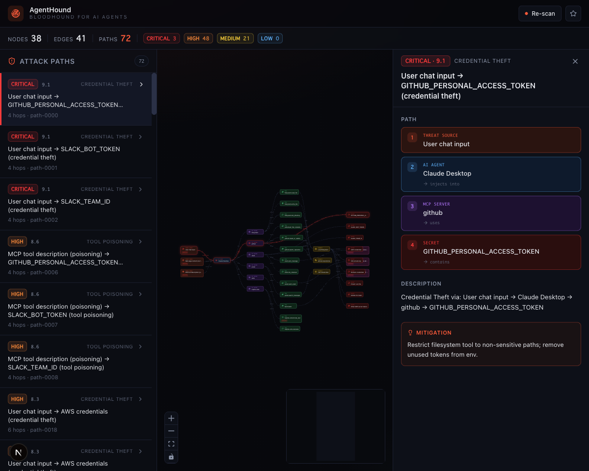

<div align="center">

# 🐕 AgentHound

### *面向 AI Agent 的 BloodHound*

**在攻击者之前，可视化你的 AI Agent MCP 工具链中的所有攻击路径。**

[🇺🇸 English](README.md) · [🇯🇵 日本語](README.ja.md) · 🇨🇳 简体中文 (当前)

[](LICENSE)
[](https://www.python.org/downloads/release/python-3140/)
[](https://github.com/Dolphinllc)
[](CONTRIBUTING.md)



</div>

---

## 为什么需要 AgentHound？

**MCP 工具链**是新的攻击面。一次提示注入（直接或间接）就可能串联 `read_file → send_email`，瞬间将 AWS 凭据外发。现有的 MCP 扫描器只能 **孤立地** 评估单个工具，错过了 **组合** 带来的真正风险。

**AgentHound** 将 AI Agent 环境建模为图，搜索攻击者可以走通的 **每一条路径**：

```
[聊天输入] ──注入──▶ [Claude Desktop] ──使用──▶ [filesystem]
                                                       │
                                                       ▼
                                       ──读取──▶ [~/.aws/credentials]
                                                       │
                                                       ▼
                                       ──调用──▶ [send_email] ──▶ attacker@evil
```

> 灵感来自 [BloodHound](https://github.com/SpecterOps/BloodHound) — 它在 Active Directory 红队领域成为事实标准。我们正在 AI Agent 生态做同样的事。

## 特性

- 🧭 **攻击路径图** — 环境内每条 Source → Sink 路径
- 🎨 **React Flow 界面** — 暗色主题、可交互、动画化的路径
- 📊 **严重性评分** — 每条路径有 CVSS 风格 0–10 分
- 🔍 **六类攻击** — 凭据窃取、工具投毒、间接提示注入、数据外发、命令注入、权限提升
- 📦 **MCP 优先** — 解析 Claude Desktop / Cursor 配置，支持 `tools/list`
- 🛠️ **CLI + REST API + Web UI** — 任你选择
- 🐍 **Python 3.14、MIT 许可** — `pip install agenthound` 即可开始

## 快速开始（60 秒）

```bash
pip install agenthound          # 或: uv pip install agenthound
agenthound scan                 # 对内置示例环境进行扫描
agenthound paths --severity critical
agenthound serve                # FastAPI 监听 :8765
```

启动 Web UI：

```bash
git clone https://github.com/Dolphinllc/agenthound
cd agenthound/frontend && pnpm install && pnpm dev
```

→ <http://localhost:3000>

## 支持的扫描源

| 来源                                          | 状态 |
|-----------------------------------------------|:----:|
| Claude Desktop `claude_desktop_config.json`   | ✅   |
| Cursor MCP 配置                                | ✅   |
| MCP `tools/list` JSON-RPC                      | ✅   |
| Claude Agent SDK                               | 🚧   |
| LangChain Agent                                | 🚧   |
| OpenAI Assistants / Responses API              | 🚧   |

## 架构

```
┌──────────────┐    ┌────────────────┐    ┌──────────────────┐    ┌─────────────┐
│ 配置文件     │ ─▶ │ 解析器         │ ─▶ │ NetworkX 图      │ ─▶ │ 路径分析器  │
│ (json/yaml)  │    │ (Pydantic)     │    │ + 威胁源注入     │    │             │
└──────────────┘    └────────────────┘    └──────────────────┘    └─────────────┘
                                                                          │
                            ┌─────────────────────────────────────────────┘
                            ▼
                ┌──────────────────────────────────┐
                │ FastAPI (REST + JSON ScanResult) │
                └──────────────┬───────────────────┘
                               │
                ┌──────────────┴───────────────────┐
                ▼                                  ▼
        ┌───────────────┐              ┌───────────────────────┐
        │ Typer CLI     │              │ Next.js + React Flow  │
        └───────────────┘              └───────────────────────┘
```

图引擎是 **纯 NetworkX**，无需数据库；所有结果均为 JSON。面向超大环境的持久化（Neo4j/Memgraph）已在路线图中。

## 路线图

- [x] MVP：parser → graph → analyzer → CLI/UI
- [x] 威胁源启发式（聊天、网页 fetch、工具投毒）
- [ ] 实时 MCP server 探测 (`agenthound probe stdio://server`)
- [ ] Cypher 风格查询语言
- [ ] AgentHound Cloud — 托管扫描与团队仪表盘
- [ ] CI 插件（PR 前置门禁）
- [ ] 攻击路径语料联合体

## 与现有工具对比

|                            | AgentHound | mcp-scan / Snyk Agent Scan | Cisco MCP Scanner | OWASP MCP Top 10 |
|----------------------------|:----------:|:--------------------------:|:-----------------:|:----------------:|
| 静态工具检查               | ✅         | ✅                         | ✅                | 仅文档           |
| **多跳攻击路径**            | ✅✨       | ❌                         | ❌                | ❌               |
| **交互式图 UI**             | ✅✨       | ❌                         | ❌                | ❌               |
| 严重性打分                  | ✅         | 部分                        | ❌                | ❌               |
| 本地优先                    | ✅         | ✅                         | ✅                | n/a              |
| OSS 许可                    | MIT        | Apache-2.0                 | Apache-2.0        | CC               |

我们与同类工具 **协作而非竞争**：AgentHound 可消费 `mcp-scan` 等的发现，作为图中额外信号。

## 贡献

欢迎 PR、issue 和新的攻击模式。请参阅 [CONTRIBUTING.md](CONTRIBUTING.md) 和 [good first issues](https://github.com/Dolphinllc/agenthound/labels/good%20first%20issue)。

报告 AgentHound 自身漏洞请参阅 [SECURITY.md](SECURITY.md)。

## 引用

如果你在研究或公开报告中使用了 AgentHound：

```bibtex
@software{agenthound2026,
  title  = {AgentHound: BloodHound for AI Agents},
  author = {{Dolphin LLC}},
  year   = {2026},
  url    = {https://github.com/Dolphinllc/agenthound}
}
```

## 许可证

MIT © 2026 [Dolphin LLC](https://github.com/Dolphinllc) — 详见 [LICENSE](LICENSE)。
